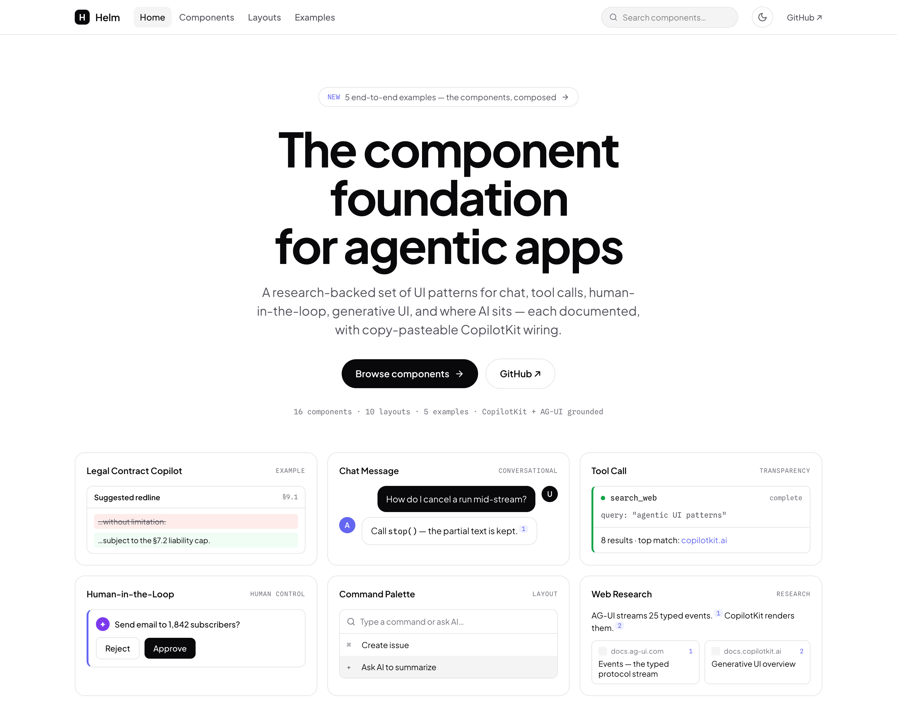

<div align="center">

# Helm

**The component foundation for agentic apps**

Beautifully designed, customizable UI components for AI copilots and agents — chat, reasoning, tool calls, generative UI, human-in-the-loop, and more. Runtime-neutral, grounded in [CopilotKit](https://docs.copilotkit.ai) + the [AG-UI protocol](https://docs.ag-ui.com), documented at two altitudes, and runnable in the gallery.

[](./LICENSE)
[](https://docs.copilotkit.ai)
[](https://docs.ag-ui.com)

</div>

<p align="center">
  
</p>

<p align="center"><sub><em>The <a href="gallery/">runnable gallery</a> — 16 components, 10 layouts, and 5 end-to-end examples, themed (light/dark) and composed.</em></sub></p>

<p align="center">
  <a href="#quickstart"><b>Quickstart</b></a> &nbsp;·&nbsp;
  <a href="#components"><b>Components</b></a> &nbsp;·&nbsp;
  <a href="#layouts"><b>Layouts</b></a> &nbsp;·&nbsp;
  <a href="#examples"><b>Examples</b></a> &nbsp;·&nbsp;
  <a href="reference/technical-foundations.md"><b>Foundations</b></a> &nbsp;·&nbsp;
  <a href="#documentation"><b>Docs</b></a>
</p>

---

## Why Helm

- **A system, not a catalogue.** Design tokens, a density model, accessibility, and a *"where AI sits"* taxonomy — the components share one coherent visual language, not just a folder of widgets.
- **Built for liveness.** Agentic UIs are *temporal* — streaming, thinking, tool-calls progressing. Motion is a first-class pillar (tokens, two personalities, a reduced-motion policy), so the interface shows the agent working.
- **Runtime-neutral, CopilotKit-grounded.** The taxonomy holds for any agentic stack; every component ships copy-pasteable [CopilotKit](https://docs.copilotkit.ai) + [AG-UI](https://docs.ag-ui.com) wiring.
- **Two altitudes.** Every component pairs the **concept** (anatomy, states, best practices, anti-patterns, accessibility) with verified, copy-pasteable **code**.
- **Accessible by default.** Keyboard paths, reduced-motion, and contrast are part of the system — not an afterthought.
- **Yours to own.** MIT-licensed and vendor-neutral. Fork it, theme it, ship it — including commercially.

---

## Quickstart

Explore every component, layout, and example in the runnable gallery:

```bash
git clone https://github.com/jerelvelarde/helm-agent-components
cd helm-agent-components/gallery
npm install
npm run dev          # → open the printed localhost URL
```

The gallery is fully presentational (mock data, no API keys). Browse **Components**, **Layouts**, and **Examples** from the top nav, toggle light/dark, and copy the CopilotKit wiring snippet beneath each story.

---

## What's inside

16 components, 10 placement patterns, and 5 end-to-end examples — each one a documented spec and a live story in the gallery.

### Components

#### Conversational core
| Component | What it is |
|---|---|
| [Chat Message](components/chat-message.md) | The atomic transcript unit — a role-attributed, streamed, Markdown-rendering turn with an action toolbar and branch navigation. |
| [Input Box / Composer](components/input-composer.md) | The prompt-entry surface — multiline autogrow, send/stop, slash commands, @mentions, attachments. |

#### Agent transparency
| Component | What it is |
|---|---|
| [Thinking / Reasoning Display](components/thinking-reasoning.md) | The disclosure that surfaces the agent's chain-of-thought / reasoning stream and live status. |
| [Tool Call](components/tool-call.md) | The card that renders a tool invocation through its `InProgress → Executing → Complete` lifecycle (name, arguments, result). |
| [Agent Status, Activity & Traceability](components/agent-activity-traceability.md) | The activity timeline + provenance layer — what the agent did, why, with citations, an audit trail, and undo. |

#### Generative UI
| Component | What it is |
|---|---|
| [Inline Generative UI](components/generative-ui-inline.md) | Agent-rendered interactive components inside the thread — the **Static / Controlled**, Declarative, and Open-Ended generative-UI spectrum. |

#### Human control
| Component | What it is |
|---|---|
| [Human-in-the-Loop Prompt](components/human-in-the-loop.md) | The pause-for-human prompt — approval (yes/no), option selection, multi-step forms, and interrupt gating, calibrated to stakes. |

#### Conversation management
| Component | What it is |
|---|---|
| [Threads / Conversation History](components/threads-history.md) | Persisted conversations — thread list, sessions, rename/search, branching, restore. |
| [Suggestions & Capability Surfacing](components/suggestions-capabilities.md) | Surfacing what the agent can do — prompt starters, suggestion chips, slash-command palette, empty/zero states. |

#### Multi-agent & research
| Component | What it is |
|---|---|
| [Sub-Agents / Multi-Agent Orchestration](components/sub-agents.md) | Delegation and hand-off UI — agent network, per-agent status, agent-to-agent (A2A). |
| [Web Research / Search](components/web-research.md) | Search with provenance — source cards, inline citations, query transparency. |
| [Deep Research](components/deep-research.md) | Long-running research agents — plan display, live progress, multi-source cited report generation. |

#### Multimodal
| Component | What it is |
|---|---|
| [Voice Input / Dictation](components/voice-input.md) | Push-to-talk / dictation — transcription, mic states, insert-to-composer. |
| [Voice Mode](components/voice-mode.md) | Realtime conversational voice (voice-in / voice-out) — orb/waveform, turn-taking, barge-in. |
| [Video](components/video.md) | Video input/output — avatars, screen share, generated video, playback. |
| [Image Generation](components/image-generation.md) | Prompt-to-image — generation progress, gallery, variations, in-image editing. |

### Layouts

> Placement defines the AI's *perceived role*, not just its position. Start with the **[Where AI Sits decision framework](layouts/README.md)** (3 axes + the agency spectrum), then pick a pattern — ordered peripheral → dominant → spatial → proactive.

| Layout | What it is |
|---|---|
| [Floating Widget / Launcher](layouts/floating-widget.md) | A bottom-right bubble that expands into a popup — reactive, task-bounded help layered over an existing app. |
| [Inline / Contextual AI](layouts/inline-contextual.md) | AI embedded in the content itself: ghost-text autocomplete, a selection → AI toolbar, an inline Cmd+K edit. |
| [Command Palette / Cmd+K](layouts/command-palette.md) | A keyboard-invoked overlay that blends commands with a natural-language ask; ephemeral and fast. |
| [Side Panel / Sidebar Copilot](layouts/side-panel.md) | An on-demand deep-context expert docked beside the work surface (the IDE/copilot model). |
| [Split View — Chat Drives a Workspace](layouts/split-view.md) | A chat pane that co-creates a live artifact shown beside it (Lovable, ChatGPT Canvas). |
| [Main Panel / Full-Page Chat](layouts/main-panel.md) | The full-page conversational app where the AI *is* the product. |
| [Canvas / Workspace & Artifacts](layouts/canvas-workspace.md) | The agent-driven infinite canvas + artifacts the agent builds beside the chat. |
| [Grid / Matrix (Cells as Agents)](layouts/grid-matrix.md) | A spreadsheet whose cells/rows are autonomous agent queries — bulk structured research. |
| [Ambient / Proactive AI](layouts/ambient-proactive.md) | Background/async agents and proactive nudges that surface without being summoned. |
| [Tabs / Mode Switching](layouts/tabs.md) | Mode switching across agent surfaces/workspaces within one view. |

### Examples

Five end-to-end screens that compose a layout + several components into recognizable products. Browse them under the **Examples** tab in the gallery, or read the walk-throughs in [examples/](examples/).

| Example | Pattern |
|---|---|
| [Legal Contract Copilot](examples/README.md#1--legal-contract-copilot) | Side-panel contract review with cited findings and gated edits. |
| [Customer-Support Copilot](examples/README.md#2--customer-support-copilot) | A floating support widget layered over a storefront. |
| [Deep-Research Workspace](examples/README.md#3--deep-research-workspace) | A full-page research agent with a live plan and sub-agents. |
| [Coding Agent Panel](examples/README.md#4--coding-agent-panel) | An IDE side-panel that edits files as reviewable diffs. |
| [Canvas / Artifact Builder](examples/README.md#5--canvas--artifact-builder) | A split view where chat co-creates a live artifact. |

---

## How it's documented

Every component and layout file follows the same shape, so the docs read consistently:

> **Definition → When to use → Anatomy → States → Vocabulary → Real-world examples → CopilotKit & AG-UI mapping (with code) → Best practices → Anti-patterns → Accessibility → Related → Sources.**

- **Two altitudes** — each file pairs the conceptual model with verified, copy-pasteable code. APIs are checked against live CopilotKit / AG-UI docs; nothing is invented.
- **CopilotKit v1 vs v2** — code prefers the **v2** hook set (`useFrontendTool`, `useRenderTool`, `useHumanInTheLoop`, `useInterrupt`, `useAgent`, …) and notes the v1 equivalent where it helps.
- **Vendor-neutral taxonomy, opinionated implementation** — the names and definitions hold for any agentic stack; the "how to build it" sections are CopilotKit-specific.

<sub>Built from a multi-source research pass across leading AI products and the CopilotKit / AG-UI ecosystem, then cross-checked against live CopilotKit and AG-UI documentation.</sub>

<details>
<summary><b>Core vocabulary</b> — the terms you need to read the rest of the system</summary>

<br>

The full cross-component glossary (200+ terms) is in [reference/glossary.md](reference/glossary.md).

| Term | Definition |
|---|---|
| **Agentic app** | An application whose primary interaction loop is an AI agent that can reason, call tools, render UI, and act — not just answer. |
| **Generative UI** | UI produced (or selected) by the model at runtime rather than fully hand-placed. Comes in **Static** (fixed component set), **Declarative** (structured spec), and **Open-Ended** (arbitrary markup) flavors, varying by *freedom* and *control*. |
| **Static / Controlled generative UI** | The model chooses from a fixed set of hand-built, typed components and fills their props. Maximum control — the "static inline component" pattern most production copilots ship. |
| **Tool call** | The agent's invocation of a function/tool, surfaced in the UI as a card moving through `InProgress → Executing → Complete`. |
| **Human-in-the-loop (HITL)** | A deliberate pause where the agent waits for human approval, choice, or input before continuing. |
| **Interrupt** | A framework-level pause emitted mid-run (e.g. LangGraph `interrupt()`), surfaced to the user and answered via `resolve`. |
| **Shared state / CoAgent** | Bidirectional state synced between the agent run and the UI, so the chat and the work surface are the same source of truth. |
| **Streaming** | Progressive rendering of tokens/state as they arrive, instead of waiting for the full result. |
| **Reasoning / thinking** | The model's intermediate thought process, optionally surfaced as a collapsible trace. |
| **Artifact** | A substantial, durable agent output (document, code, app) rendered in a dedicated surface beside the chat (e.g. Claude Artifacts, ChatGPT Canvas). |
| **Provenance / citation** | The traceable link from an agent claim to its source, so output is verifiable. |
| **A2A** | Agent-to-Agent — protocols/UX for one agent delegating to and coordinating with others. |
| **AG-UI** | The open Agent–User Interaction protocol: the typed event stream (messages, tool calls, state, lifecycle) that frontends render. |
| **CopilotKit** | The React UI layer + runtime for agent-native apps; speaks AG-UI. See [reference/copilotkit-primitives.md](reference/copilotkit-primitives.md). |

</details>

<details>
<summary><b>Repository layout</b></summary>

<br>

```
helm-agent-components/
├── components/   ← 16 component specs (the conversational + agentic building blocks)
├── layouts/      ← 10 placement patterns + a "Where AI Sits" decision framework
├── examples/     ← 5 end-to-end example apps that compose the components
├── gallery/      ← the runnable Vite + React + Tailwind gallery
└── reference/    ← technical foundations, CopilotKit/AG-UI references, glossary, sources
```

</details>

---

## Documentation

- **[Technical foundations](reference/technical-foundations.md)** — the design & architecture decision doc: how Helm should be customizable, distributable, built, and **animated**, with a first-class **motion / liveness pillar** — positioned as *the design system for agentic apps*.
- **[CopilotKit primitive reference](reference/copilotkit-primitives.md)** — hooks, components, the `ToolCallStatus` lifecycle, generative-UI types, theming, runtime.
- **[AG-UI protocol reference](reference/ag-ui-protocol.md)** — the typed event model every component renders.
- **[Glossary](reference/glossary.md)** — the full cross-component vocabulary.
- **[Sources](reference/sources.md)** — consolidated citations.

---

## License & credit

Created and maintained by **[Jerel Velarde](https://github.com/jerelvelarde)**. Released under the [MIT License](./LICENSE) — free to use, fork, remix, and ship, including in commercial work. Attribution appreciated, not required.
